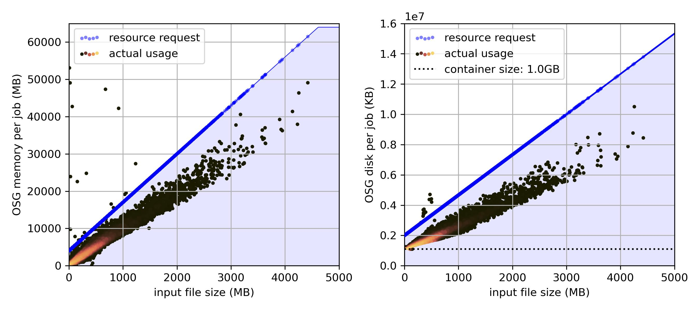

# GlacierLakeDetectionICESat2

NOTE: This repo is private for now. (early testing stage)

**A repository for automatic supraglacial lake detection and depth deptermination on the ice sheets in ICESat-2 data**

## Workflow: 

### Setup:
- Get a user account on the [OSG Open Science Pool](https://osg-htc.org/services/open_science_pool) (free for US-based researchers and their collaborators), or another high-throughput computing platform running HTCondor, that fulfills computing needs

- If the [singularity](https://docs.sylabs.io/guides/3.5/user-guide/introduction.html#) container image `icelake-container_v1.sif` is not available, follow singularity install and container build instructions to build the container image from `singularity_container/icelake-container_v1.def` (need administrator privileges, so this step needs to be done locally). Alternatively, define your own container that fulfills the requirements.
  - Copy the singularity container image into stash, for OSG this would be something like `osdf:///ospool/<your_access_point>/data/<your_username>/containers/icelake-container_v1.sif`

- To be able to access ICESat-2 data, [create a NASA Earthdata user account](https://urs.earthdata.nasa.gov/). In this code, the class `icelakes.nsidc.edc` is used to read in credentials, but there are plenty of options to store credentials, they just need to be accessible to the jobs running on the OSG Pool. This can be changed directly in the main python script `detect_lakes.py`, where credentials are passed to `icelakes.nsidc.download_granule()`.

### New approach for NSIDC data access:
- Data requests are based on the drainage basin regions (stored in `[geojsons/](geojsons/)`), which are the IMBIE basins with floating ice added to its nearest grounded basin. Basin definition from source ([Antarctica](https://nsidc.org/data/nsidc-0709/versions/2)/[Greenland](https://datadryad.org/stash/dataset/doi:10.7280/D1WT11)) is detailed in `[basins/make_basins.ipynb](basins/make_basins.ipynb)`.
- Using the notebook `[request_data_and_make_granule_list.ipynb](request_data_and_make_granule_list.ipynb)`:
  - Make all the needed **asynchonous** requests from NSIDC. There is one request per melt season / drainage shapefile combination.
  - Monitor the progress of order processing at NSIDC.
  - When all orders are complete, compile the granule list using the granule download links provided by NSIDC. These links will be active for 14 days. The final granule list (with extra info about the NSIDC request) should look something like this:
    <br><pre></pre>
  - For large runs, request OSG job resources adaptively by specifiying requested memory and disk in the granule list for submission, based on the input file size of the subsetted granule at hand:
  <br><pre></pre>
  - Create a Condor submit file for job submission, similar to the ones in `HTCondor_submit/`. Requesting 16 GB of both disk and memory will be sufficient for the vast majority of jobs.
    - Make sure each batch does not exceed 20K jobs, and you don’t submit more than 100K jobs at once.

### Running the jobs on the OSG pool:
- Before submitting the first cluster *make sure you have saved any of the output files that you want to keep from previous runs*, and then clear the directories for output file, outs, logs, errs with `rm detection_out_data/* detection_out_stat/* detection_out_plot/* logs/* errs/* outs/*`

- **Submit the jobs** with `condor_submit HTCondor_submit/<your_submit_file>.submit`. [Monitor and troubleshoot jobs](https://portal.osg-htc.org/documentation/htc_workloads/submitting_workloads/monitor_review_jobs/) with condor_q and related commands. A few useful commands:
  - `condor_q` or `watch condor_q` as a summary to keep track of clusters and jobs 
  - `condor_q -long <cluster>.<job>` to see all classad attributes of the job in question
  - `condor_q <cluster> -held -af HoldReasonSubCode` to figure out **why jobs were held** (can also adjust and use `HoldReasonCode` or `HoldReasonSubCode` or other classad attributed
  - `ls detection_out_data | wc -l; ls detection_out_plot/*quicklook*.jpg | wc -l; ls detection_out_plot/*detail*.jpg | wc -l; ls detection_out_plot | wc -l` to check on the number of files that have been sent back from jobs
  - something like `grep -A 3 "Traceback (most recent call last):" errs/*.err | tail -n 100` to figure out errors in jobs that have completed
  - `condor_release fliphilipp -constraint "HoldReasonCode==13"` to release held jobs due to a transfer input file error (seems to be happening sometimes with the singularity container)
  - `condor_q -better-analyze <cluster>.<job> -pool flock.opensciencegrid.org` when **jobs remain idle**, to figure out which job requirement(s) make the jobs not match any of the available resources

- **Troubleshoot jobs that go on hold** with condor_q -held and the log files, common reasons seem to be:
  - *The job (shadow) restarted too many times*: This can happen mostly when the NSIDC download requests fail (for whichever reason) and return a bad status. If it looks like this is the reason, try re-submitting those held jobs in a new cluster.
  - *Input file transfer failed*: This seemed to be a problem with the job node’s access to the container image on stash/osdf. Re-submit these jobs in a new cluster, if the problem persists use a new version of the container / force osdf to write a new file.
  - *memory usage exceeded request_memory*: This should only be a small fraction of jobs. Re-submit these few jobs in a new cluster with higher memory/disk requests. (Unfortunately there is no good way to predict in advance how much memory a job will take up because it depends on the final subsetted size of the granuled delivered by the NSIDC API. However, 32 GB should do for all granules that I’ve seen so far.)

- Keep track of the jobs that failed (and associated granule/geojson combinations) and get them all done eventually
  - use `condor_hold <cluster_id> -constraint "JobStatus==2" -reason "Job was held manually."` to place jobs that seem to be stuck on running on hold. You can release those again, or include them in your next run (with jobs that were held due to insufficient memory)
  - When no more jobs are idle/running, run `bash getheld.sh -c <cluster_id> -n <descriptive_cluster_name>` (example: `bash getheld.sh -c 114218 -n antarctica-18-21-run1`)
    - Make sure all jobs are accounted for. If not, change script to allow for any other hold reasons.
  - Copy the file output to `hold_lists/` with a `final_` prefix (just to make sure to not overwrite them accidentally). You can now remove the cluster from the pool with `condor_rm <cluster_id>`
  - Use `resubmit_make_list.ipynb` to create a new granule list with the held jobs
    - Keep track of the few jobs that ran out of memory, to run later with a higher `request_memory` requirement
    - Other jobs (usually re-started to often because of NSIDC API issues, or sometimes input file transfer failure) can be re-submitted to the pool, using a new submit file with the list generated in `resubmit_make_list.ipynb`
  - If all fails, maybe run a handful of jobs locally and troubleshoot??? / Or skip if something seems awfully off with the data…

### Retrieving the output data:
- **Transfer back output data** to a local computer with `scp` or move them to cloud storage using `rclone`. (for scp, ideally zip the entire directory and transfer that, if you don't need the log/err/out files anymore this is sped up substantially by removing those first, also helps to concatenate all the granule stats before)
  - *outside* the project directory `tar -czvf /ospool/ap21/data/<username>/<filename>.tar.gz path/to/GlacierLakeDetectionICESat2`
  - then `scp <username>@ap21.uc.osg-htc.org:/ospool/ap21/data/<username>/<filename>.tar.gz /path/to/local/folder`

### Post-processing:
- use [`rename_data_and_get_stats.ipynb`](rename_data_and_get_stats.ipynb) to rename the output files in a way such that they are sorted by lake quality. this also creates a summary dataframe of lake locations and other properties (if you use the Ross Ice Shelf basins provided here, you may want to re-write these lakes properties by sorting them into the right original basin)
- use [`make_quicklook_plots.ipynb`](https://github.com/fliphilipp/FLUIDSuRRF-code/blob/main/make_quicklook_plots.ipynb) to make "quicklook" plots for all the output files (this requires a [Google Earth Engine](https://earthengine.google.com/) account, and the associated Python API)
- There might be some weird false positives, mostly over a few regions where the basins overlap with the ocean or ice-marginal lakes - browse through the quicklook images and manually remove files that are clearly not lakes. [`simple-image-labeler/`](https://github.com/fliphilipp/FLUIDSuRRF-code/tree/main/simple-image-labeler) includes a streamlit app that helps with sorting through output files for a final manual check, like this:


## Useful commands for OSG:

Login to access node with SSH Keys set up
([Generate SSH Keys and Activate Your OSG Login](https://support.opensciencegrid.org/support/solutions/articles/12000027675)):
```
ssh <username>@<osg-login-node>
```
Example:
```
ssh fliphilipp@login05.osgconnect.net
```

Submit a file to HTCondor:
```
condor_submit <my_submit-file.submit>
```

Watch the progress of the queue after submitting jobs:
```
watch condor_q
```

See which jobs are on hold and why:
```
condor_q -hold
```

Release and re-queue jobs on hold:
```
condor_release <cluster ID>/<job ID>/<username>
```

Remove jobs on hold:
```
condor_rm <cluster ID>/<job ID>/<username>
```

Example to grep log files for memory/disk usage:
```
grep -A 3 'Partitionable Resources' <log_directory>/*.log
```

Put a container in /public stash:
```
scp <mycontainer>.sif fliphilipp@login05.osgconnect.net:/public/fliphilipp/containers/
```

Explore a container on access node:
```
singularity shell --home $PWD:/srv --pwd /srv --scratch /var/tmp --scratch /tmp --contain --ipc --pid /public/fliphilipp/containers/<mycontainer>.sif
```

## To get Singularity working with root privileges:

Get some required packages: 
```
$ sudo apt-get update && sudo apt-get install -y \
    build-essential \
    libssl-dev \
    uuid-dev \
    libgpgme11-dev \
    squashfs-tools \
    libseccomp-dev \
    wget \
    pkg-config \
    git \
    cryptsetup
```
    
Remove any previous intallation of Go, if needed: 
```
$ rm -rf /usr/local/go
```

Download Go and untar: 
```
$ wget https://go.dev/dl/go1.19.linux-amd64.tar.gz
$ sudo tar -C /usr/local -xzf go1.19.linux-amd64.tar.gz
```

Add to path and check installation of Go: 
```
$ echo 'export PATH=/usr/local/go/bin:$PATH' >> ~/.bashrc && source ~/.bashrc
$ go version
```

Need glibc for Singularity install:
```
$ sudo apt-get install -y libglib2.0-dev
```

Download Singularity and untar:
```
$ wget https://github.com/sylabs/singularity/releases/download/v3.10.2/singularity-ce-3.10.2.tar.gz
$ tar -xzf singularity-ce-3.10.2.tar.gz
```

Move to the directory and run installation commands:
```
$ ./mconfig
$ make -C builddir
$ sudo make -C builddir install
```

